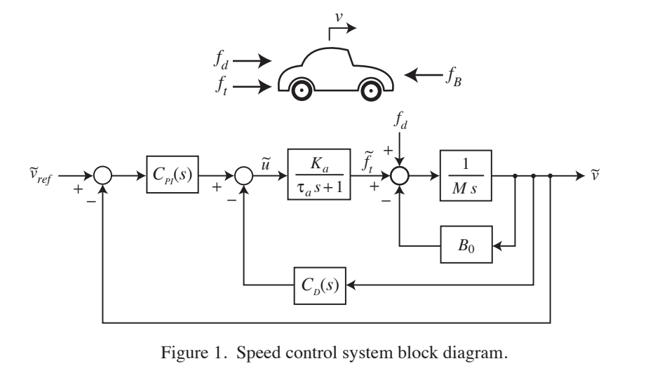
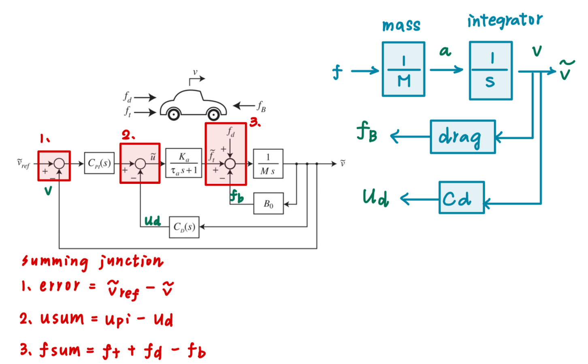
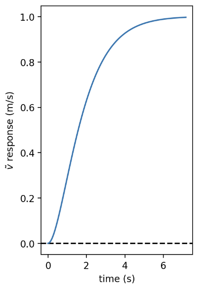
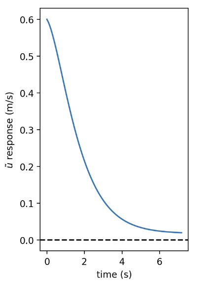
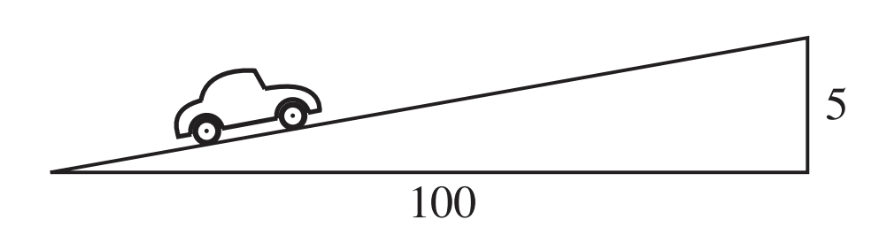
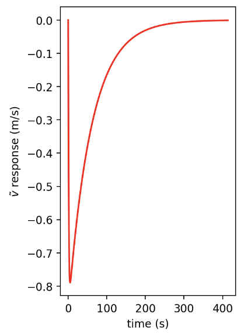
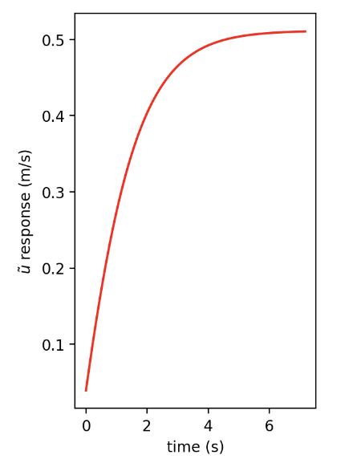

<h1 align="center" style="color: white;">🚘 Digital Control_HW1</h1>
<p align="center">
    
    <br><br>
</p>

### a. Use interconnect command to generate a state-space model for the dynamic system above.
#### 👉First, import modules:
``` shell
import numpy as np                              #numerical library
import matplotlib.pyplot as plt                 #plotting library
%config InlineBackend.figure_format='retina'    #high-res plots
import control.matlab as ctm                    #matlab layer for control systems library
import control as ct                            #use regular control library
ct.set_defaults('statesp', latex_repr_type='separate')
```

#### 👉Secondly, set up all parameters.
``` shell
v0 = 25     #unit = m/sec
Ka = 1590   #unit = N
taua = .5   #unit = sec
M = 1670    #unit = kg
B0 = 27.8   #unit = N/m/sec
g = 9.8     #unit = m/sec/sec
Kp = 0.6    #unit = 1/m/sec
ki = .01    #unit = 1/m
kd = .08    #unit = 1/m/sec^2
```
#### 👉Next, determine all transfer function based on figure 1.
<p align="center">
    
    <br><br>
</p>

``` shell
#Setting control block diagram
pi = ctm.tf([kp, ki], [1, 0])           #Proportional-integral controller
motor = ctm.tf(ka, [tau_a, 1])
mass = ctm.tf(1, M)
integrator = ctm.tf(1, [1, 0])
drag = ctm.tf(b0, 1)
d = ctm.tf(kd, 1)

#Create IOsystem with named signals
pi_controller = io.tf2io(pi, inputs='e', outputs='upi')
motor_io = io.tf2io(motor, inputs='u', outputs='ft')
mass_io = io.tf2io(mass, inputs='f', outputs='a')
itegrator_io = io.tf2io(integrator, inputs='a', outputs='v')
drag_io = io.tf2io(drag, inputs='v', outputs='fb')
d_controller = io.tf2io(d, inputs='a', outputs = 'ud')   
```
#### 👉Forth, determine the summing junction based on figure 1.
<p align="center">
    
    <br><br>
</p>

``` shell
#Setting three summing junction
error = ct.summing_junction(['vref', '-v'], 'e')
usum = ct.summing_junction(['upi', '-ud'], 'u')
fsum = ct.summing_junction(['ft', 'fd', '-fb'], 'f')
```
#### 👉To get the state-space model, use interconnect command:
``` shell
#Connect block diagram and summing junction
sys = io.interconnect([pi_controller, motor_io, mass_io, itegrator_io, drag_io, d_controller, error, usum, fsum], 
                      inputs=['vref', 'fd'], outputs=['v', 'u'])
print('(A) Generate state space:')
display(sys)
```
### b. Use step command to plot the system's output v and u response to a 1 m/sec step.
``` shell
#Extract system input-output pairs
#Index order is [output, input]fi
sys_vref_2_v = sys[0, 0]
y1, t = ctm.step(sys_vref_2_v)
plt.subplot(1,2,1)
plt.axhline(0, ls='--', c='k')
plt.plot(t, y1)
plt.xlabel('time (s)')
plt.ylabel(r'$\tilde v$ response (m/s)')
plt.figure();

sys_vref_2_u = sys[1, 0]
y2, t = ctm.step(sys_vref_2_u)
plt.subplot(1,2,2)
plt.axhline(0, ls='--', c='k')
plt.plot(t, y2)
plt.xlabel('time (s)')
plt.ylabel(r'$\tilde u$ response (m/s)')
plt.figure();
```
#### Results as below:
<p align="center">
    
    
</p>

##### 💡The picture on your left shows how the system reacts over time to a sudden change in input from 0 to 1 m/sec. This plot indicates that the system starts at zero, and when the step input is applied, the velocity gradually increases and finally approaches 1 m/sec.
##### 💡The picture on your right has an initial value of 0.6 which is likely a result of the proportional gain acting onthe initial error. Kp is set to 0.6, and given that the initial error(setpoint-output) is 1, the initial control action would be Kp x error = 0.6 x 1 = 0.6. This plot indicates that the control input u starts at a high value and then decrease over time,approaching zero. As the system approaches the target velocity, the control action is reduced.

### c. Use step command to plot the system's v and u response to a long hill that has a constant 5% grade.
<p align="center">
    
    <br><br>
</p>

``` shell
grade = -m * g * np.sin(0.05)  #5% grade step response

sys_fd_2_v = sys[0,1]
y3, t = ctm.step(sys_fd_2_v)
plt.subplot(1,2,1)
plt.plot(t, y3 * grade, 'r')
plt.xlabel('time (s)')
plt.ylabel(r'$\tilde v$ response (m/s)')
plt.figure();

sys_fd_2_u = sys[1,1]
y4, t = ctm.step(sys_fd_2_u)
plt.subplot(1,2,2)
plt.plot(t, y4 * grade, 'r')
plt.xlabel('time (s)')
plt.ylabel(r'$\tilde u$ response (m/s)')
plt.figure();
```
#### Results as below:
<p align="center">
    
    
</p>

##### 💡The picture on your left shows the velocity response of the system when a disturbance due to a 5% uphill grade is applied. The negative sign indicates the velocity decrease due to the uphill grade.
##### 💡The second plot shows that positive values of the u suggest that the control system is acting to counter the effect of the uphill grade by applying more force or power.