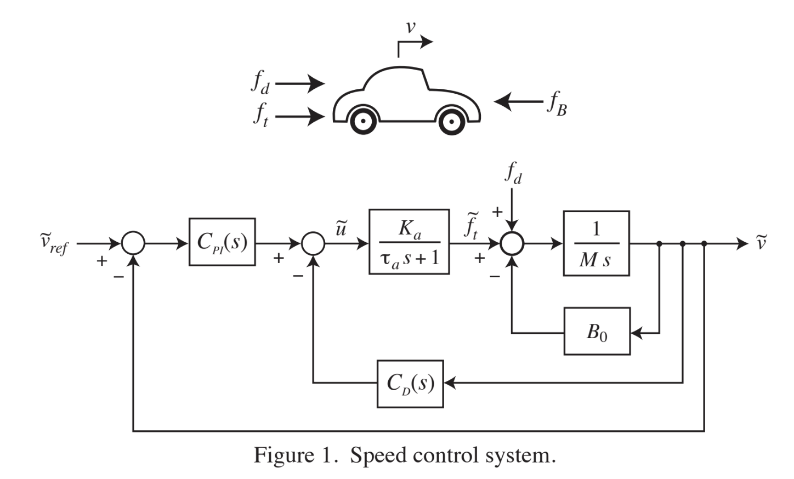

<h1 align="center" style="color: white;">🚘 Digital Control_HW2</h1>
<p align="center">
    
    
    <br><br>
</p>

## 1. Please construct the discrete-time controller for the dynamics system in figure 1.
### a. Using these finite-difference-based approximations to continuous-time proportional, integral, derivative control law:
<p align="center">
    
    <br><br>
</p>

### where T is the sampling period, create discrete-time controller transfer function systems Cpi(Z) and Cd(Z) for figure 2 system.
#### Now, we need to transfer continuous-time controller to discrete-time controller:
<p align="center">
    
    <br><br>
</p>

#### Next, I choose to use MATLAB to construct my discrete-time system by adding GZAS(z):
``` shell
%% Parameters that we'll use:

v0 = 25     %unit = m/sec
Ka = 1590   %unit = N
taua = .5   %unit = sec
M = 1670    %unit = kg
B0 = 27.8   %unit = N/m/sec
g = 9.8     %unit = m/sec/sec
Kp = 0.6    %unit = 1/m/sec
ki = .01    %unit = 1/m
kd = .08    %unit = 1/m/sec^2
```
``` shell
%% Discrete Time System transfer function:
motor_dts = tf([0, ka], [tau_a, 1]);
motor_dts.InputName = 'u_dts';
motor_dts.OutputName = 'ft_dts';

Cpi_dts = tf([kp, ki], [1, 0]);
Cpi_dts.InputName = 'e_dts';
Cpi_dts.OutputName = 'upi_dts';

mass_dts = tf([0, 1], [0, M]);
mass_dts.InputName = 'f_dts';
mass_dts.OutputName = 'a_dts';

Cd_dts = tf([kd, 0], [0, 1]);
Cd_dts.InputName = 'a_dts';
Cd_dts.OutputName = 'ud_dts';

integrator_dts = tf(1, [1, 0]);
integrator_dts.InputName = 'a_dts';
integrator_dts.OutputName = 'v_dts';

drag_dts= tf([0, b0], [0, 1]);
drag_dts.InputName = 'v_dts';
drag_dts.OutputName = 'fb_dts';

%% Three summing junctions:
error_dts = sumblk('e_dts = vref_dts -v_dts');
usum_dts = sumblk('u_dts = upi_dts - ud_dts');
fsum_dts = sumblk('f_dts = ft_dts + fd_dts - fb_dts');

% Create GZAS(z)
car = tf(1, [M, b0]);
car.InputName = 'f_dts';
car.OutputName = 'v_dts';
fsum_plant = sumblk('f_dts = ft_dts + fd_dts - fb_dts');
plant = connect(motor_dts, car, fsum_plant, ...
                           {'u_dts', 'fd_dts'}, {'v_dts'})
plant_dts = c2d(plant, 2, 'zoh')           % Transfer plant from cts to dts

T = 2;                                                    % Set up sampling time
cpi_z = tf([kp+ki*T  -kp],[1,  -1],T)        %Cpi(z)
cd_z = tf([kd/T, -kd/T],[1,  0],T)            %Cd(z)
cpi_z.InputName = 'e_dts';
cpi_z.OutputName = 'upi_dts';
cd_z.InputName = 'v_dts';
cd_z.OutputName = 'ud_dts';

sys_dts = connect(plant_dts, cpi_z, cd_z, error_dts, usum_dts, ...
                             {'vref_dts', 'fd_dts'}, {'v_dts', 'u_dts'});
```
#### Also, create a continuous-time system:
``` shell
%% Continous Time System

motor = tf([0, ka], [tau_a, 1]);
motor.InputName = 'u';
motor.OutputName = 'ft';

Cpi = tf([kp, ki], [1, 0]);
Cpi.InputName = 'e';
Cpi.OutputName = 'upi';

mass = tf([0, 1], [0, M]);
mass.InputName = 'f';
mass.OutputName = 'a';

Cd = tf([0, kd], [0, 1]);
Cd.InputName = 'a';
Cd.OutputName = 'ud';
integrator = tf(1, [1, 0]);
integrator.InputName = 'a';
integrator.OutputName = 'v';

drag = tf([0, b0], [0, 1]);
drag.InputName = 'v';
drag.OutputName = 'fb';

error = sumblk('e = vref -v');
usum = sumblk('u = upi - ud');
fsum = sumblk('f = ft + fd - fb'); 

sys_cts = connect(Cpi, motor, mass, integrator, Cd, drag, error, usum, fsum, ...
                            {'vref', 'fd'}, {'v', 'u'})
```
#### Compare discrete-time system with continuous-time system response to a 1 m/sec step input:
``` shell
%% Create step response for 1m/sec
sys_vref_2_vp_cts = sys_cts(1, 1);
sys_vref_2_vp_dts = sys_dts(1, 1);
figure() 
step(sys_vref_2_vp_cts);
hold on
step(sys_vref_2_vp_dts);
hold off
```
#### Result as below(vref vs v):
<p align="center">
    
    <br><br>
</p>

#### Compare discrete-time system with continuous-time system response to a long hill 5% grade:
``` shell
%% Create step response for a constant 5% grade uphill.
step_scale = -M * g * 0.05;
sys_fd_2_v_cts = sys_cts(1, 2);
sys_fd_2_v_dts = sys_dts(1, 2);
figure()
step(sys_fd_2_v_cts * step_scale);
hold on
step(sys_fd_2_v_dts * step_scale);
hold off
```
#### Result as below(fd vs v):
<p align="center">
    
    <br><br>
</p>

#### Plot z-plane map for discrete-time system and explain why the peak v overshoot?
``` shell
figure()
pzmap(sys_dts(1, 1))
grid on, hold on

sys_cts_poles = pole(sys_cts(1, 1));
sys_cts_zeros = zero(sys_cts(1, 1));

sys_cts_poles_z = exp(sys_cts_poles * 2);
sys_cts_zeros_z = exp(sys_cts_zeros * 2);

plot(real(sys_cts_poles_z), imag(sys_cts_poles_z), 'x', 'Color', [0.5, 0.8, 0.1])
plot(real(sys_cts_zeros_z), imag(sys_cts_zeros_z), 'o', 'Color', [0.5, 0.8, 0.1])
```
#### Result as below:
<p align="center">
    
    
    <br><br>
</p>