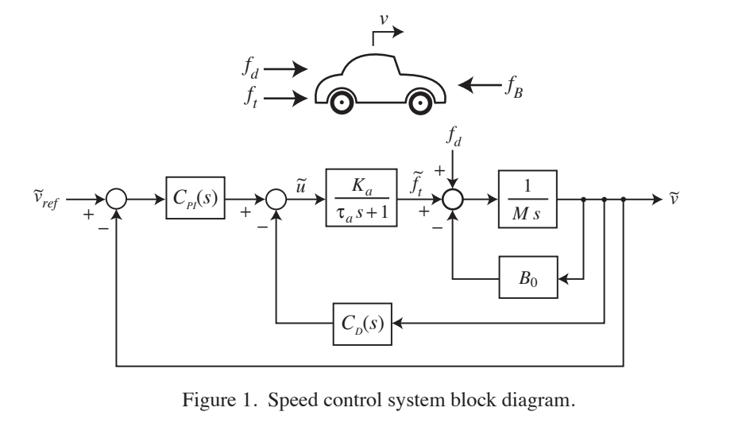
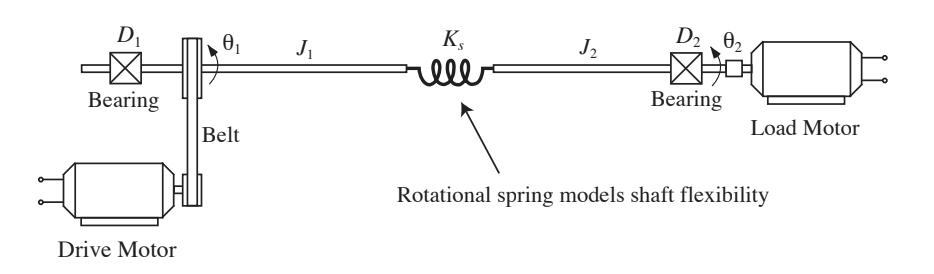

<h1 align="center" style="color: white;">🚘 ME581 Digital Control</h1>

    <b>This repo includes the codes and works that related to ME581 in UW, 
       this course is related to the transform between analog and digital 
       control.</b>
    
    <b>This picture will be used in HW1~HW3</b>
      

### 📚HW1 : Using the connect(Matlab) or interconnect(Python-control) command to generate a state-space model.
### 📚HW2 : Using these finite-difference-based approximations to continuous-time proportional, integral, and derivative control laws.
### 📚HW3 : Using Simulink to simulate the analog and digital control systems.
### 📚HW4 : The analog and digital control system for a DC motors experiments.

      
    
    <b>This picture will be used in HW4.</b>

### 📚HW5 : Using direct z-plane root locus design method to determine a lead compensator/ a proportional controller.
### 📚HW6 : Using loopshaping controller/compensator design method to determine values for the controller's parameters.
